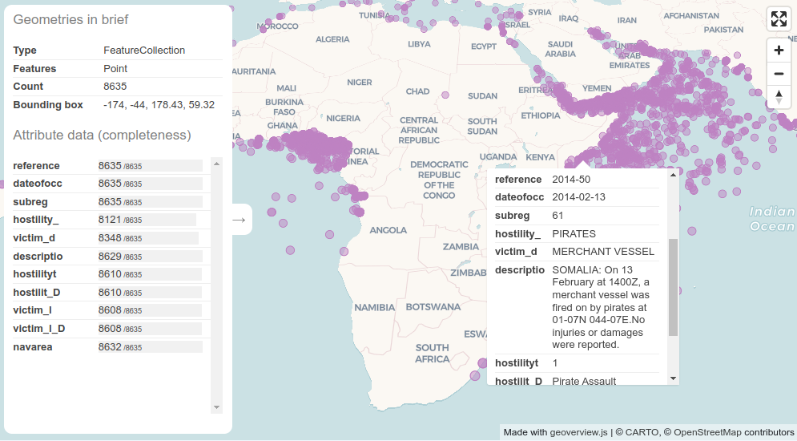

# geoverview.js

 

Based on [maplibre-gl](https://maplibre.org/), **geoverview** is a tool for giving a quick and easy geographic **overview** of any **geo**json (and the information it contains). Geoverview is particularly suitable for working within [Observable](https://observablehq.com/@neocartocnrs/geoverview).



## How to use?

It is very simple, geoverview contains only one function. In Observable, it is used in the following way. You need 3 cells:

```js
// Loading geoverview
view = require("geoverview@1.2").then((f) => f.view)
```

```js
// add a geojson (or topojson) file
data = FileAttachment("something.geojson").json()
```

```js
// add a geojson (or topojson) file
view(data)
```

Automatically, the map and your geojson will be displayed. So simple...

## Demo

Live demo on this [page](https://neocarto.github.io/geoverview) or this Observable [notebook](https://observablehq.com/@neocartocnrs/geoverview).

## Options

You can add some options like this:

```js
view(data, {width:800, renderWorldCopies:false})
```

Option list:

- **width**: width of the map (default: 1000)
- **height**: height of the map (default: 550)
- **col**: Color of the displayed geojson (default: "#be82c2")
- **fillOpacity**: fill opacity (default: 0.5)
- **lineWidth**: line thickness (default 1 if point or polygon, 3 if line)
- **colOver**: color when an object is hovered (default: "#ffd505")
- **renderWorldCopies**: If true , multiple copies of the world will be rendered side by side beyond -180 and 180 degrees longitude (default: true)
- **style**: basemap style: "night", "fulldark", "voyager","positron","icgc","osmbright","hibrid" (default: voyager)

## Things to fix/improve

- [ ] Add an example that works outside of Observable ([#1](https://github.com/neocarto/geoverview/issues/1))
- [ ] In [Quarto](https://quarto.org/), the rendering of the infoboxes is not good. Css problem? ([#2](https://github.com/neocarto/geoverview/issues/2))

See all [issues](https://github.com/neocarto/geoverview/issues).

## Contribute

If you want to improve geoverview, feel free to post [issues](https://github.com/neocarto/geoverview/issues) (bugs, suggestions...) and suggest [pull requests](https://github.com/neocarto/geoverview/pulls).
